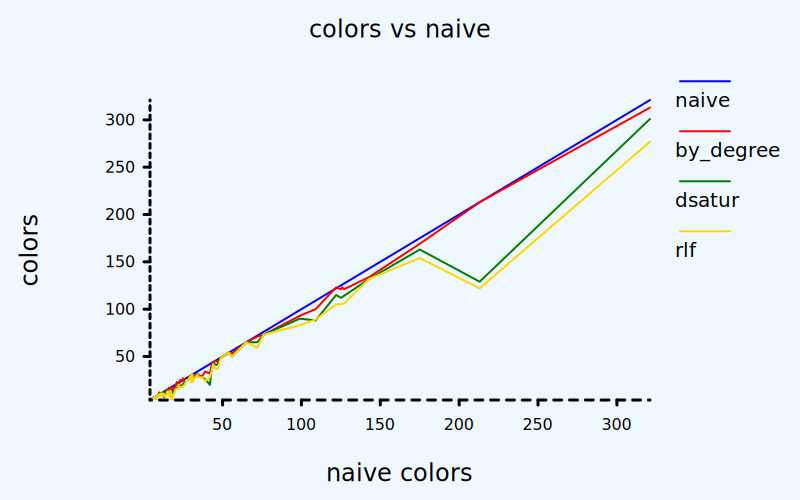
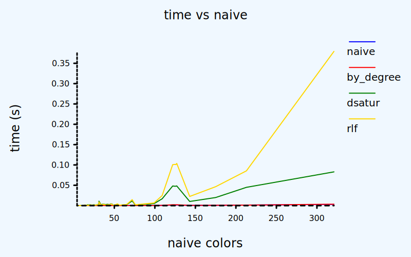

[GitHub](https://github.com/victorvde/heuristic-graph-coloring) | [Crates.io](https://crates.io/crates/heuristic-graph-coloring) | [Docs.rs](https://docs.rs/heuristic-graph-coloring/latest/heuristic-graph-coloring/)

This crate provides algorithms for solving the [graph vertex coloring problem](https://en.wikipedia.org/wiki/Graph_coloring).
These algorithms return a "coloring", i.e. an assignment of each vertex to a "color" (index) such that no two vertices of the same color are connected by an edge.
The algorithms use heuristics to minimize the number of different colors used.

Current status: basic functionality is working, but not very optimized and not extensively tested.

Example:
```
use heuristic_graph_coloring::*;

let mut graph = VecVecGraph::new(4); // Create a new graph with 4 vertices
graph.add_edge(0, 1);
graph.add_edge(1, 2);
graph.add_edge(0, 2);
graph.add_edge(0, 3);
let coloring = color_greedy_by_degree(&graph);
println!("{:?}", coloring); // [0, 1, 2, 1]
```

# Algorithms

Name | Function | Colors used | Time used | Comment
---|---|---|---|---
[Greedy (naive)](https://en.wikipedia.org/wiki/Greedy_coloring) | [color_greedy_naive] | Most | Least | Only use as a baseline.
[Greedy (by degree)](https://en.wikipedia.org/wiki/Greedy_coloring) | [color_greedy_by_degree] | A bit less | Least | Fast decent results.
[DSatur](https://en.wikipedia.org/wiki/DSatur) | [color_greedy_dsatur] | Less | More | Good results but quite slow.
[Recursive largest first](https://en.wikipedia.org/wiki/Recursive_largest_first_algorithm) | [color_rlf] | Even less | Even more | Slowest and worst time complexity, but best results.

If you really want the least number of colors there is are slower algorightms like backtracking, SAT-solvers or HEA evolutionary approaches. The above algorithms are still useful to determine an upper bound in advance.

On the other hand, if you want to go faster then there exist parallel and distributed graph coloring algorithms.

# Tests

Using a data set of instances (see `instances/` folder) and the number of colors found by the naive algorithm as a measure of difficulty, we get the following results:




See the full results in `data/instances.tsv`.
